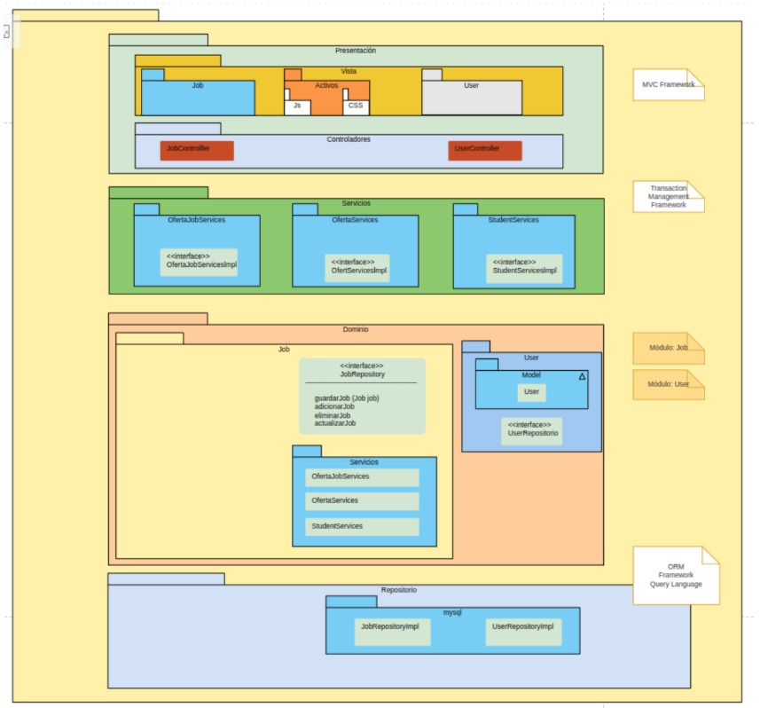
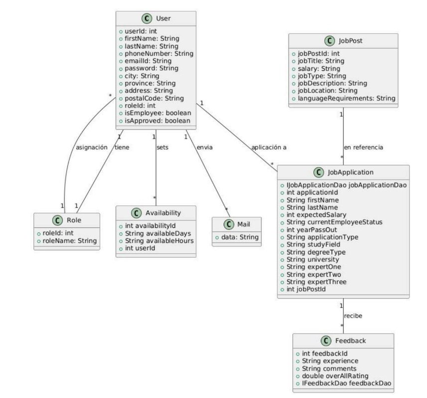
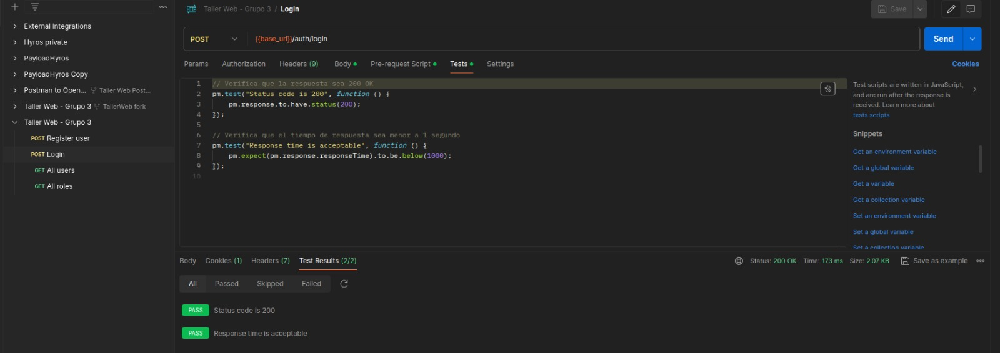
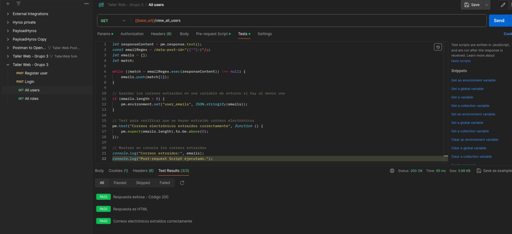

# Integrantes del Proyecto (Grupo 3)
1. Ortega Moran, Kenneth Evander
2. Saenz Chang, Jesus Angel
3. Saul Alexander Liñan Paredes
4. Román Céspedes, Samuel Aarón
5. Cabrera Ccancce Alexis Ronni
6. Zapata Aguinaga Fabio Sthefano Sneyder
# 1. Propósito del Proyecto
### Descripción
El Sistema de Bolsa de Trabajo es una plataforma diseñada para conectar a estudiantes y empresas, facilitando la gestión integral de ofertas laborales, postulaciones, notificaciones y manejo de documentos
### Objetivo
El objetivo principal del proyecto es desarrollar un sistema que:
  - Permita a los usuarios (estudiantes y empresas) gestionar sus perfiles, documentos y credenciales de forma segura.
  - Facilite la publicación y administración de ofertas de empleo, permitiendo a las empresas publicar y actualizar sus oportunidades laborales.
  - Permita a los estudiantes postularse a las ofertas mediante un proceso automatizado, optimizando la comunicación y seguimiento.
  - Implemente una arquitectura en capas basada en Domain-Driven Design (DDD) para lograr alta cohesión, escalabilidad y mantenibilidad.
# 2. Visión General de Arquitectura
La arquitectura del sistema está basada en el diseño dirigido por el dominio (DDD) y sigue una arquitectura en capas. Las capas principales incluyen:

- **Capa de Presentación:** Interfaz de usuario que interactúa con los usuarios finales (estudiantes y empresas).
- **Capa de Aplicación:** Contiene la lógica de aplicación y coordina la interacción entre la capa de presentación y la capa de dominio.
- **Capa de Dominio:** Contiene la lógica de negocio central, incluyendo entidades, agregados, servicios de dominio y repositorios.
- **Capa de Infraestructura:** Proporciona implementaciones concretas para los repositorios y otros servicios de infraestructura como la persistencia de datos y la gestión de notificaciones.

# 3. Principales Servicios REST y Funcionalidades
## Módulos del Proyecto
El sistema se compone de varios módulos clave:

- **Módulo de Autenticación y Autorización:** Gestiona el registro, inicio de sesión y permisos de los usuarios.
- **Módulo de Gestión de Perfiles:** Permite a los usuarios gestionar sus perfiles, documentos y credenciales.
- **Módulo de Ofertas Laborales:** Facilita la publicación y administración de ofertas de empleo.
- **Módulo de Postulaciones:** Permite a los estudiantes postularse a las ofertas laborales y gestionar sus aplicaciones.

## Operaciones Disponibles

## Modelos: Entidades y Agregados
- **Usuario:** Representa a un usuario del sistema (estudiante o empresa) con atributos como nombre, correo electrónico, contraseña, etc.
- **OfertaLaboral:** Representa una oferta de empleo publicada por una empresa con atributos como título, descripción, requisitos, etc.
- **Postulacion:** Representa una postulación de un estudiante a una oferta laboral con atributos como fecha de postulación, estado, etc.

# 4. Prácticas de Desarrollo
### Construcción Automática
pipeline {
    agent any
    
    tools {
        jdk 'JAVA'
        maven 'maven'
    }
    
    environment{
        SCANNER_HOME = tool 'sonar-scanner'
    }
    
    stages {

        stage("Git Checkout") {
            steps {
               git branch: 'main', changelog: false, poll: false, url: 'https://github.com/XoChang/TallerWeb'
            }
        }
        
        stage("Build with Maven") {
            steps {
                bat "mvn clean compile"
            }
        }
        
        stage("SonarQube Analysis") {
            steps {
                bat """
                $SCANNER_HOME/bin/sonar-scanner -Dsonar.url=http://localhost:9000/ ^
                    -Dsonar.login=squ_0975245e87f6c98946889ce1af7e1e9116b0c7e3 ^
                    -Dsonar.projectKey=my:project ^
                    -Dsonar.projectName=Myproject ^
                    -Dsonar.sources=. ^
                    -Dsonar.java.binaries=target/classes"""
            }
        }
        
        stage("Run Tests"){
            steps{
                bat "mvn test"
            }
        }
        
        stage("Deploy and Run"){
            steps{
                bat "mvn clean package"
                bat "mvn spring-boot:run"
            }
        }

    }
}

### Análisis Estático

## Pruebas Unitarias
- Desarrollar pruebas unitarias para asegurar que los componentes individuales del sistema funcionen correctamente. Utilizar frameworks de pruebas como JUnit para Java.

## Pruebas de API
- Realizar pruebas de API para verificar que los servicios REST funcionen según lo esperado. Utilizar herramientas como Postman para definir y ejecutar las pruebas.

 

# 5. Conclusiones
El Sistema de Bolsa de Trabajo es una plataforma integral que facilita la conexión entre estudiantes y empresas, optimizando la gestión de ofertas laborales y postulaciones. A través de una arquitectura en capas y el uso de prácticas de desarrollo modernas, el sistema busca lograr alta cohesión, escalabilidad y mantenibilidad, proporcionando una experiencia segura y eficiente para todos los usuarios.
